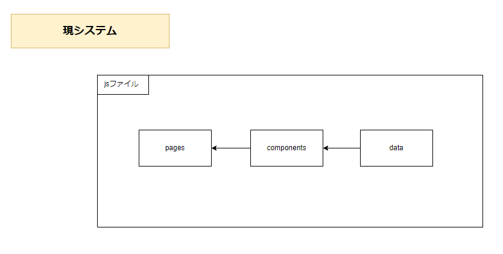
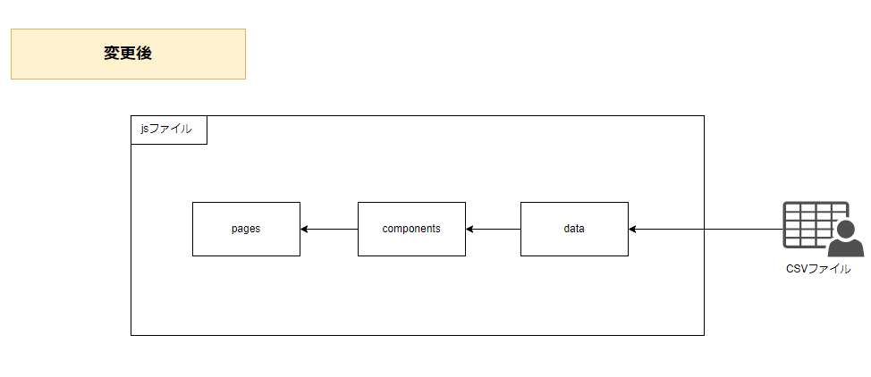
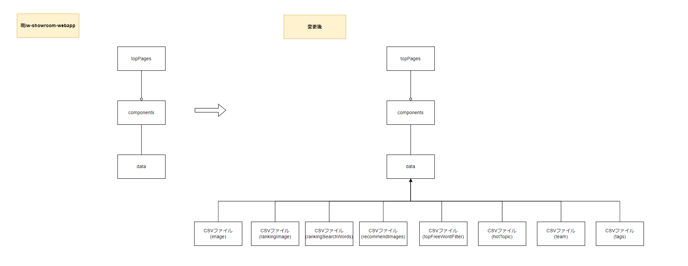
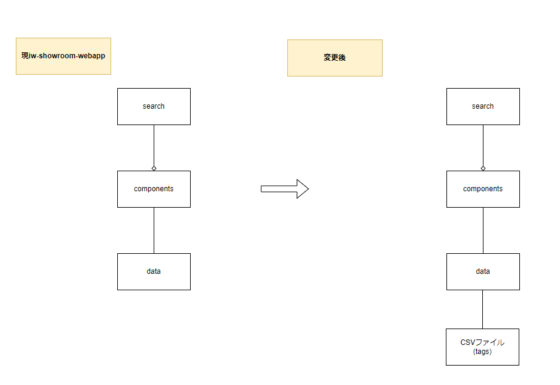

# iw-showroom-webapp　詳細設計書

- [iw-showroom-webapp　詳細設計書](#iw-showroom-webapp詳細設計書)
  - [実現すべき機能](#実現すべき機能)
  - [システム構成](#システム構成)
    - [現iw-showroom-webapp](#現iw-showroom-webapp)
    - [変更後](#変更後)
      - [ファイル構成](#ファイル構成)
        - [現iw-showroom-webappのファイル構成](#現iw-showroom-webappのファイル構成)
        - [変更後のファイル構成](#変更後のファイル構成)
  - [実現方針](#実現方針)
    - [ID1](#id1)
      - [クラス図](#クラス図)
        - [pages](#pages)
        - [detail](#detail)
        - [search](#search)
    - [ID2](#id2)
      - [データ取得方法](#データ取得方法)
        - [シーケンス図](#シーケンス図)
    - [ID3](#id3)
      - [CSVから取得したデータの変換](#csvから取得したデータの変換)

| 版  | 日付         | 担当     | 修正箇所 | 修正内容 |
|----|------------|--------|------|------|
| 1.0 | 2023/4/26 | FFS 伊藤 | -    | 新規作成 |

## 実現すべき機能

* 現iw-showroom-webappは、jsファイルにコンポーネントが使用する値が直接記載されているため、簡単に表示データを変えることができない。
* そのため、以下を実施して表示データを簡単に変更できるようにする。

| ID | やりたいこと          | 実現する機能                           |
|---|------------------------|----------------------------------------|
| 1 | CSVファイルの差し替えを行えば、表示するデータを変更できるようにしたい。 | コンポーネントに画像データ等を渡している箇所を洗い出し、CSVから取得するよう変更する。|
| 2 | 同上 | データを取得するタイミングを変更する。
| 3 | 同上 | jsファイルと同等の内容をCSVファイルから取得する。

## システム構成

### 現iw-showroom-webapp

  

### 変更後

  

#### ファイル構成

##### 現iw-showroom-webappのファイル構成

* 変更に関係するところのみ

| フォルダ/ファイル | | 概要 |
|-------------------|-|------|
| | | | |
| | | |
| | | | |
| | | |

##### 変更後のファイル構成

* 追加する複数のCSVをどこで取得するか

| フォルダ/ファイル | | 概要 |
|-------------------|-|------|
| | | | |
| | | |
| | | | |
| | | |

## 実現方針

### ID1

* 現システムは、表示コンポーネントは〇個あり、取得データは〇パターンに分けることができる。
* 各コンポーネントの詳細は[現iw-showroom-webapp構成調査書](https://fujifilm0-my.sharepoint.com/:x:/r/personal/10023916_003_fujifilm_com/_layouts/15/Doc.aspx?sourcedoc=%7B32DE0FE6-B080-4226-A6B3-0A8182B2CF03%7D&file=%E6%97%A2%E5%AD%98%E3%81%AE%E6%A7%8B%E6%88%90%E8%AA%BF%E6%9F%BB.xlsx&action=default&mobileredirect=true)に記載。

#### クラス図

* 各ページごとに、変更前・後のクラス図を記載する。
* 本設計での変更箇所のみ記載。
* 
##### pages
  

##### detail
  

##### search
  

### ID2

#### データ取得方法

##### シーケンス図

* 各パターンのシーケンス図
* 各データを取得する用の関数設定を決定する。

### ID3

#### CSVから取得したデータの変換

* CSV→Mapオブジェクトの変換方法