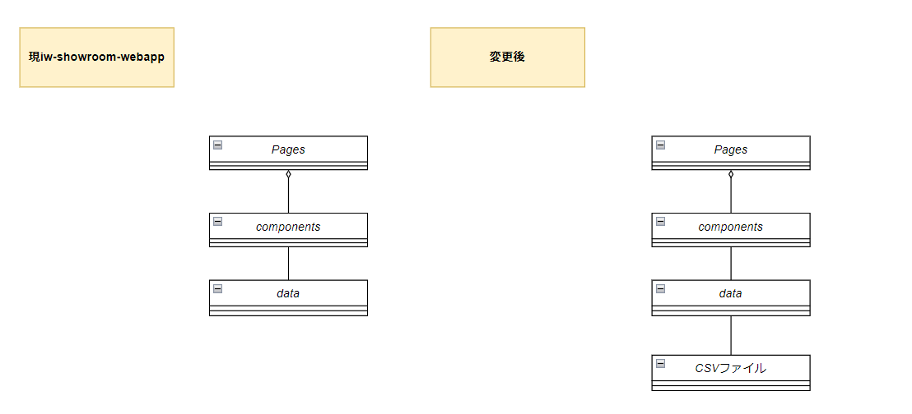
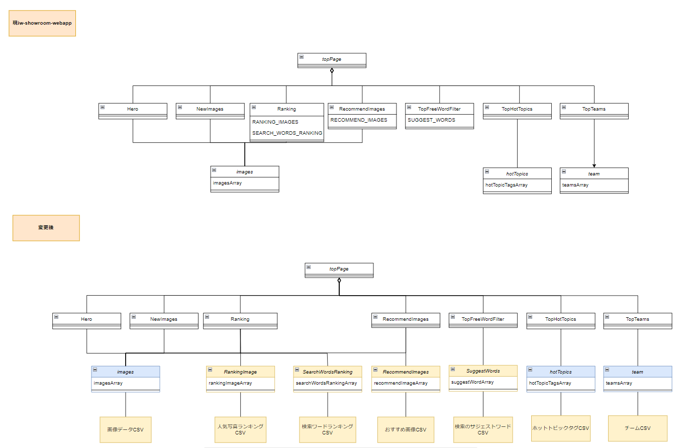
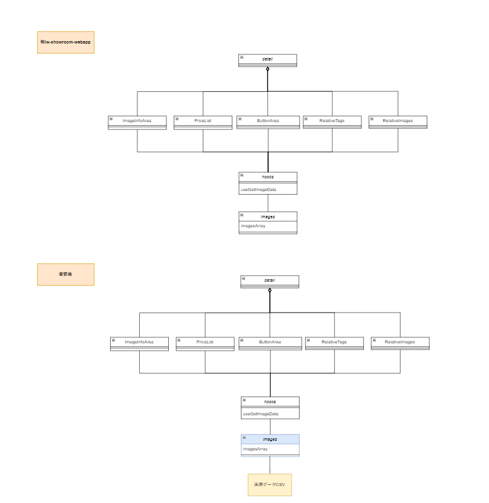
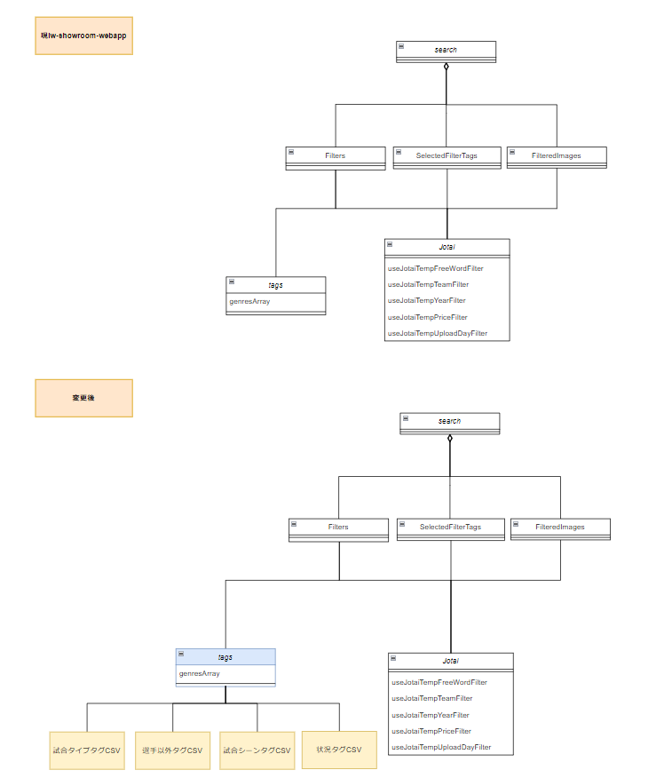

# iw-showroom-webapp　詳細設計書

- [iw-showroom-webapp　詳細設計書](#iw-showroom-webapp詳細設計書)
  - [用語](#用語)
  - [実現すべき機能](#実現すべき機能)
  - [実現方針](#実現方針)
    - [ID1](#id1)
      - [ID1-1](#id1-1)
        - [アーキテクチャ図](#アーキテクチャ図)
        - [クラス図](#クラス図)
          - [topPage](#toppage)
          - [detail](#detail)
          - [search](#search)
        - [ファイル構成](#ファイル構成)
          - [現iw-showroom-webappのファイル構成と変更箇所](#現iw-showroom-webappのファイル構成と変更箇所)
          - [追加するファイル](#追加するファイル)
      - [ID1-2](#id1-2)
        - [シーケンス図](#シーケンス図)
          - [画像データCSV](#画像データcsv)
    - [ID1-3](#id1-3)
      - [CSVから取得したデータの変換](#csvから取得したデータの変換)
    - [ID2](#id2)

| 版  | 日付         | 担当     | 修正箇所 | 修正内容 |
|----|------------|--------|------|------|
| 1.0 | 2023/4/26 | FFS 伊藤 | -    | 新規作成 |

## 用語

  topPage：
* 以下ページを指す。
  
  detail：
* 以下ページを指す。
  
*   search：
* 以下ページを指す。
  

* データ：iw-showroom-webappの画面表示コンポーネントに使用される、表示画像やそれに付随する情報。現iw-showroom-webappのdataフォルダ以下に格納されている値を示す。

* ページコンポーネント：topPage、detail、searchのベースとなっているコンポーネント。
* 部品コンポーネント: ページコンポーネントで使用されているコンポーネント。

## 実現すべき機能

* 現iw-showroom-webappは、jsファイルにコンポーネントが使用する値が直接記載されているため、簡単に表示データを変えることができない。そのため、以下を実施して表示データを簡単に変更できるようにする。
* また、表示データの取得方法が変わったことで現iw-showroom-webappにあった機能を、変更後どのように実現するか決定する。

| ID | やりたいこと | 実現する機能 |
|---|---------------|--------------|
| 1 | 表示データを簡単に変更できるようにしたい。 | CSVから表示データを取得する。|
| 2 | 現iw-showroom-webappに元々備わっている機能(取得した表示データが、有効なデータであるか整合性をとる)も有効にしたい | CSVに記載されているデータ同士の整合性をとる。 |

## 実現方針

### ID1

* ID1を実現するために、以下3つを行う。

| ID | 設計方針 |
|----|--------------|
| 1-1 | jsファイルで定義しているデータをCSVに移行する。|
| 1-2 | データを取得するタイミングを変更、部品コンポーネントが使用する形にデータを加工する。|
| 1-3 | jsファイルと同等の内容をCSVファイルから取得する。|

#### ID1-1

* 現システムで、部品コンポーネントは、JSファイルに直接記載されたデータを参照している。
* JSファイルに直接記載されたデータは11箇所あるため、これらをCSVファイルに移行する。また、CSVファイル移行後も、データを参照している部品コンポーネントが変わらず使用できるよう、CSVから受取得したデータを部品コンポーネントが使用する形に加工する処理を追加する。

* 各コンポーネントの詳細は[現iw-showroom-webapp構成調査書](https://fujifilm0-my.sharepoint.com/:x:/r/personal/10023916_003_fujifilm_com/_layouts/15/Doc.aspx?sourcedoc=%7B32DE0FE6-B080-4226-A6B3-0A8182B2CF03%7D&file=%E6%97%A2%E5%AD%98%E3%81%AE%E6%A7%8B%E6%88%90%E8%AA%BF%E6%9F%BB.xlsx&action=default&mobileredirect=true)に記載。

##### アーキテクチャ図

* 基本の方針としては、jsファイルに記載されているデータをCSVファイルに移行する。
* 部品コンポーネントがデータを参照する場合は、dataでCSVファイルからデータの取得を行い、取得した値を部品コンポーネントが使用できる形に加工し渡す。
* components以上は、変更前と同じ値を受け取れるようにすることで、変更の影響を受けないようにする。

  

| 項目 | 変更前 | 変更後 | 
|----------|--------|--------|
| Pages | ページコンポーネントを表す。 | 変更なし |
| components | 部品コンポーネントを表す。 | 変更なし |
| data | データを記載しているtsファイル。その値を加工しているtsファイルを表す。 | CSVファイルからデータを取得し、componentsが使用する形に加工する。|
| CSVファイル | なし | データを記載しているtsファイル。その値を加工しているtsファイルを表す。 |

##### クラス図

* ページコンポーネントごとに、既存と変更後のクラス図を記載する。
* 新規で作成する箇所を黄色、変更する箇所を青色で表す。

###### topPage

  

| クラス名 | 変更前 | 変更後 | 
|----------|--------|--------|
| topPage | ページコンポーネント、topPageを表す。 | 変更なし |
| Hero | topPageの部品コンポーネントを表す。 | 変更なし |
| NewImages | topPageの部品コンポーネントを表す。 | 変更なし |
| Ranking | topPageの部品コンポーネントを表す。 | 変更なし |
| RecommendImages | topPageの部品コンポーネントを表す。 | 変更なし |
| TopFreeWordFilter | topPageの部品コンポーネントを表す。 | 変更なし |
| TopHotTopics | topPageの部品コンポーネントを表す。 | 変更なし |
| TopTeams | topPageの部品コンポーネントを表す。 | 変更なし |
| images | 画像の詳細情報と部品コンポーネント用の加工処理。 | CSVから画僧データの取得、取得データを部品コンポーネントが使用する形に加工する。|
| rankingImage | なし | CSVファイルに移行したRANKING_IMAGESCを取得、取得データを部品コンポーネントが使用する形に加工する。|
| searchWordsRanking | なし | CSVファイルに移行したSEARCH_WORDS_RANKINGを取得、取得データを部品コンポーネントが使用する形に加工する。|
| recommendImages | なし | CSVファイルに移行したRECOMMEND_IMAGESを取得、取得データを部品コンポーネントが使用する形に加工する。|
| suggestWords | なし | CSVファイルに移行したSUGGEST_WORDSを取得、取得データを部品コンポーネントが使用する形に加工する。|
| hotTopics | 画像の詳細情報と部品コンポーネント用の加工処理。 | CSVからホットトピックタグデータの取得、取得データを部品コンポーネントが使用する形に加工する。|
| team | 画像の詳細情報と部品コンポーネント用の加工処理。 | CSVからチームデータの取得、取得データを部品コンポーネントが使用する形に加工する。|
| 画像データCSV | なし | jsファイルに直接記載されていた画像データをCSVファイルに移行する。 |
| 人気写真ランキングCSV | なし | jsファイルに直接記載されていた人気写真ランキング配列をCSVファイルに移行する。 |
| 検索ワードランキングCSV | なし | jsファイルに直接記載されていた検索ワードランキング配列をCSVファイルに移行する。 |
| おすすめ画像CSV | なし | jsファイルに直接記載されていたおすすめ画像名配列をCSVファイルに移行する。 |
| 検索のサジェストワードCSV | なし | jsファイルに直接記載されていた検索のサジェストワード配列をCSVファイルに移行する。 |
| ホットトピックタグCSV | なし | jsファイルに直接記載されていたホットトピックタグ配列をCSVファイルに移行する。 |
| チームCSV | なし | jsファイルに直接記載されていたチーム配列をCSVファイルに移行する。 |

###### detail

  

| クラス名 | 変更前 | 変更後 | 
|----------|--------|--------|
| detail | ページコンポーネント、detailを表す。 | 変更なし |
| ImageInfoArea | detailの部品コンポーネントを表す。 | 変更なし |
| PriceList | detailの部品コンポーネントを表す。 | 変更なし |
| ButtonArea | detailの部品コンポーネントを表す。 | 変更なし |
| RelativeTags | detailの部品コンポーネントを表す。 | 変更なし |
| RelativeImages | detailの部品コンポーネントを表す。 | 変更なし |
| images | なし | topPageと同様。|
| 画像データCSV | なし | topPageと同様。 |

###### search

  

| クラス名 | 変更前 | 変更後 | 
|----------|--------|--------|
| search | ページコンポーネント、searchを表す。 | 変更なし |
| Filters | searchの部品コンポーネントを表す。 | 変更なし |
| SelectedFilterTags | searchの部品コンポーネントを表す。 | 変更なし |
| FilteredImages | searchの部品コンポーネントを表す。 | 変更なし |
| Jotai | 現ページの状態(検索に使用している文字列、こだわり条件フィルタなど)を管理している。 | 変更なし |
| tags | 画像の詳細情報と部品コンポーネント用の加工処理。 | 以下4つのCSVからタグデータの取得、取得データを部品コンポーネントが使用する形に加工する。|
| 試合タイプタグCSV | なし | jsファイルに直接記載されていた試合タイプタグ配列をCSVファイルに移行する。 |
| 選手以外タグCSV | なし | jsファイルに直接記載されていた選手以外タグ配列をCSVファイルに移行する。 |
| 試合シーンタグCSV | なし | jsファイルに直接記載されていた試合シーンタグ配列をCSVファイルに移行する。 |
| 状況タグCSV | なし | jsファイルに直接記載されていた状況タグ配列をCSVファイルに移行する。 |

##### ファイル構成

* 現在のファイル構成と、変更後の修正内容を表にまとめる。

###### 現iw-showroom-webappのファイル構成と変更箇所

| フォルダ/ファイル |  |  | 概要 | 変更 |
|-------------------|---|---|---|---|---|
| assets |  | | 画像を格納。 | × |
| chakra |  | |フォント、カラーなどの設定ファイル格納。 | × |
| components | | | 複数ページに共通のコンポーネントを格納。 | × |
| data | | | 画像などの表示に必要なデータを格納。 | - |
| | images | index.ts | 画像データ(imagesArray)を部品コンポーネントが使用する形に加工する処理を格納。 | data.tsxから受け取ったデータを部品コンポーネントが使用する形に加工する。 |
| | | data.ts | 画像データの二次元配列を格納。 | 元の配列はCSVファイルに移行。CSVから画像データを取得する処理を新規で作成。 |
| | players | index.ts | 選手名の型を定義。 | 削除(詳細はID2参照) |
| | | data.ts | 選手名の配列を格納。 | 削除(詳細はID2参照) |
| | tags | index.ts | タグの型を定義。 | タグデータを部品コンポーネントが使用する形に加工する。 |
| | | genres | タグの配列を格納。 | 元の配列はCSVファイルに移行。CSVからジャンルタグデータを取得する処理を新規で作成。 |
| | | hotTopic.ts | タグの配列を格納。 | 元の配列はCSVファイルに移行。CSVからホットトピックタグデータを取得する処理を新規で作成。 |
| | team | index.ts | チームデータを部品コンポーネントに渡すように加工している処理を格納。 | チームデータを部品コンポーネントが使用する形に加工する。 |
| | | data.ts | チームデータの二次元配列を格納。 | 元の配列はCSVファイルに移行。CSVからチームデータを取得する処理を新規で作成。|
| features | | | ページコンポーネントが使用する、部品コンポーネントを格納。 | 一部jsファイルに直接記載されているデータ配列はCSVファイルに移行。 |
| functions | | | 複数ページに共通の関数を格納。 | × |
| hooks | | | ページのルーターを行う関数を格納。 | × |
| jotai | | | カート情報の状態を管理する関数を格納。 | × |
| layouts | | | フッター、ヘッダー等の全ページに共通するコンポーネントを格納。 | × |
| pages | | | ページコンポーネントを格納。 | × |

###### 追加するファイル

* 現在のファイル構成に、以下CSVファイルを追加する。

| フォルダ | ファイル名 | 概要 |
|-------------------|------------|------|
| csv | image.csv | 画像データCSV |
| | rankingImage.csv | 人気写真ランキングCSV |
| | searchWordsRanking.csv | 検索ワードランキングCSV |
| | recommendImage.csv | おすすめ画像CSV |
| | suggestWord.csv | 検索のサジェストワードCSV |
| | hotTopicTags.csv | ホットトピックタグCSV |
| | team.csv | チームCSV |
| | gameSceneTags.csv | 試合タイプタグCSV |
| | managerTags.csv | 選手以外タグCSV |
| | gameTypeTags.csv | 試合シーンタグCSV |
| | situationTags.csv | 状況タグCSV |

#### ID1-2

* 現システムでは、部品コンポーネントが使用するデータは、必要な時直接データを取得していた。
* データをCSVに移行すると、CSVの読み込み時間がかかるため、データを読み込むタイミングを修正する必要がある。
* また、データを参照するたびにCSVを読み込むのではなく、一度しかデータは読み込まず、値を使いまわすようにしたい。

##### シーケンス図

* ID1-1より、CSVファイルは11ファイル作成するため、それぞれの取得タイミングを決定する。

###### 画像データCSV

### ID1-3

#### CSVから取得したデータの変換

* CSV→Mapオブジェクトの変換方法

### ID2

* 本設計に必要な部分のみ記載する。
 

* 削除するファイル

| フォルダ/ファイル | | | 理由 |
|-------------------|-|-|------|
| data | player | data.ts | 現iw-showroom-webappでは、imageから取得した画像データのplayer要素の型定義のために使用していた。しかし、playerはここでしか使用されていないため、型定義をしなくても問題ないと判断。 |
| data | player | index.ts | 同上 |

* 追加するファイル

| フォルダ/ファイル | | 概要 |
|-------------------|-|------|
| | | | |
| | | |
| | | | |
| | | |