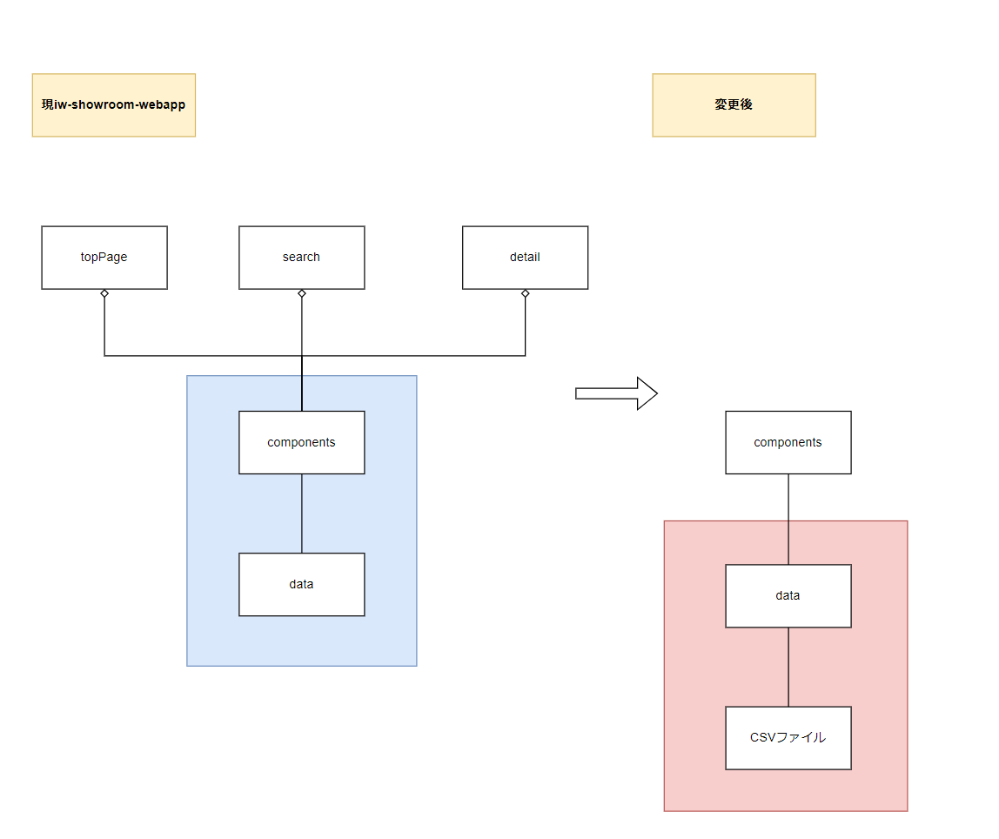

# iw-showroom-webapp　詳細設計書

- [iw-showroom-webapp　詳細設計書](#iw-showroom-webapp詳細設計書)
  - [用語](#用語)
  - [実現すべき機能](#実現すべき機能)
  - [実現方針](#実現方針)
    - [ID1](#id1)
      - [ID1-1](#id1-1)
      - [クラス図](#クラス図)
      - [ファイル構成](#ファイル構成)
        - [現iw-showroom-webappのファイル構成](#現iw-showroom-webappのファイル構成)
    - [ID1-2](#id1-2)
      - [データ取得方法](#データ取得方法)
        - [シーケンス図](#シーケンス図)
    - [ID1-3](#id1-3)
      - [CSVから取得したデータの変換](#csvから取得したデータの変換)
    - [ID2](#id2)

| 版  | 日付         | 担当     | 修正箇所 | 修正内容 |
|----|------------|--------|------|------|
| 1.0 | 2023/4/26 | FFS 伊藤 | -    | 新規作成 |

## 用語

  topPage：
* 以下ページを指す。
  
  detail：
* 以下ページを指す。
  
*   search：
* 以下ページを指す。
  

* データ：iw-showroom-webappの画面表示コンポーネントに使用される、表示画像やそれに付随する情報。現iw-showroom-webappのdataフォルダ以下に格納されている値を示す。

* ページコンポーネント：topPage、detail、searchのベースとなっているコンポーネント。
* 部品コンポーネント: ページコンポーネントで使用されているコンポーネント。

## 実現すべき機能

* 現iw-showroom-webappは、jsファイルにコンポーネントが使用する値が直接記載されているため、簡単に表示データを変えることができない。そのため、以下を実施して表示データを簡単に変更できるようにする。
* また、表示データの取得方法が変わったことで現iw-showroom-webappにあった機能を、変更後どのように実現するか決定する。

| ID | やりたいこと | 実現する機能 |
|---|---------------|--------------|
| 1 | 表示データを簡単に変更できるようにしたい。 | CSVから表示データを取得する。|
| 2 | 現iw-showroom-webappに元々備わっている機能(取得した表示データが、有効なデータであるか整合性をとる)も有効にしたい | ID1の変更に合わせて、データの整合性をとる。 |

## 実現方針

### ID1

* ID1を実現するために、以下3つを行う。

| ID | 設計方針 |
|----|--------------|
| 1-1 | jsファイルで定義しているデータをCSVに移行する。|
| 1-2 | データを取得するタイミングを変更する。|
| 1-3 | jsファイルと同等の内容をCSVファイルから取得する。|

#### ID1-1

* 現システムは、表示コンポーネントは〇個あり、取得データは〇パターンに分けることができる。
* 各コンポーネントの詳細は[現iw-showroom-webapp構成調査書](https://fujifilm0-my.sharepoint.com/:x:/r/personal/10023916_003_fujifilm_com/_layouts/15/Doc.aspx?sourcedoc=%7B32DE0FE6-B080-4226-A6B3-0A8182B2CF03%7D&file=%E6%97%A2%E5%AD%98%E3%81%AE%E6%A7%8B%E6%88%90%E8%AA%BF%E6%9F%BB.xlsx&action=default&mobileredirect=true)に記載。
* 

#### クラス図

* ID1-1を実現するため、青枠のjsファイルからデータを取得していた部分を変更し、赤枠のCSVからデータを取得する構成とする。
* 
* めも
* 具体的なCSVファイル名、関数名は、ID1-1ファイル構成、ID1-2完了後に記載する。

  

#### ファイル構成

##### 現iw-showroom-webappのファイル構成

* 

| フォルダ/ファイル |  |  | 概要 | 変更 |
|-------------------|---|---|---|---|---|
| assets |  | | 画像を格納。 | × |
| chakra |  | |フォント、カラーなどの設定ファイル格納。 | × |
| components | | | 複数ページに共通のコンポーネントを格納。 | × |
| data | | | 画像などの表示に必要なデータを格納。 | - |
| | images | index.ts | 画像データを部品コンポーネントに渡すように加工している処理を格納。 | 画像データを部品コンポーネントに渡す関数を作成。 |
| | | data.ts | 画像データの二次元配列を格納。 | CSVファイルに移行 |
| | players | index.ts | 選手名の型を定義。 | 削除(詳細はID2参照) |
| | | data.ts | 選手名の配列を格納。 | 削除(詳細はID2参照) |
| | tags | index.ts | タグの型を定義。 | タグデータを部品コンポーネントに渡す関数を作成。 |
| | | genres | タグの配列を格納。 | CSVファイルに移行 |
| | | hotTopic.ts | タグの配列を格納。 | CSVファイルに移行 |
| | team | index.ts | チームデータを部品コンポーネントに渡すように加工している処理を格納。 |チームデータを部品コンポーネントに渡す関数を作成。 |
| | | data.ts | チームデータの二次元配列を格納。 | CSVファイルに移行 |
| features | | | ページコンポーネントが使用する、部品コンポーネントを格納。 | 一部CSVファイルに移行 |
| functions | | | 複数ページに共通の関数を格納。 | × |
| hooks | | | ページのルーターを行う関数を格納。 | × |
| jotai | | | カート情報の状態を管理する関数を格納。 | × |
| layouts | | | フッター、ヘッダー等の全ページに共通するコンポーネントを格納。 | × |
| pages | | | ページコンポーネントを格納。 | × |

### ID1-2

#### データ取得方法

##### シーケンス図

* 各パターンのシーケンス図
* 各データを取得する用の関数設定を決定する。

### ID1-3

#### CSVから取得したデータの変換

* CSV→Mapオブジェクトの変換方法

### ID2

* 本設計に必要な部分のみ記載する。
 

* 削除するファイル

| フォルダ/ファイル | | | 理由 |
|-------------------|-|-|------|
| data | player | data.ts | 現iw-showroom-webappでは、imageから取得した画像データのplayer要素の型定義のために使用していた。しかし、playerはここでしか使用されていないため、型定義をしなくても問題ないと判断。 |
| data | player | index.ts | 同上 |

* 追加するファイル

| フォルダ/ファイル | | 概要 |
|-------------------|-|------|
| | | | |
| | | |
| | | | |
| | | |