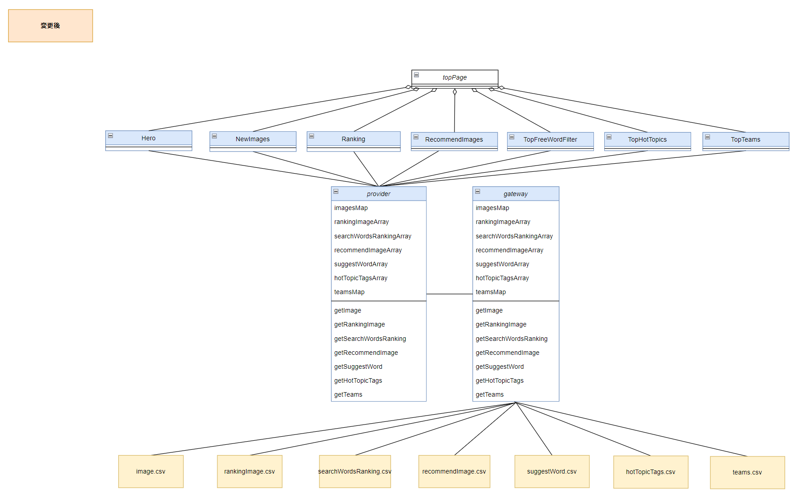
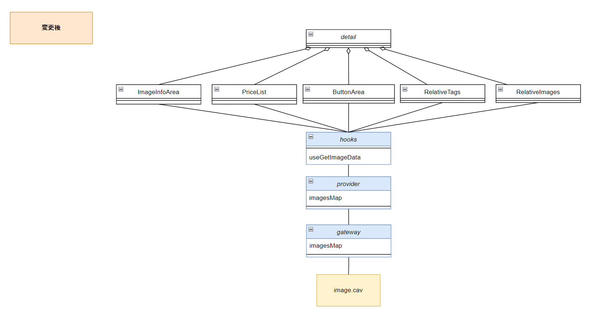
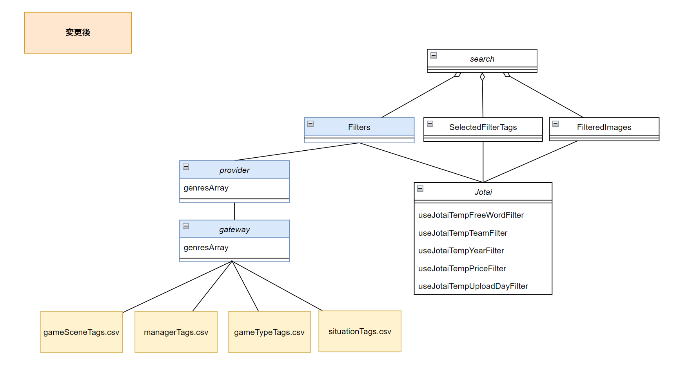
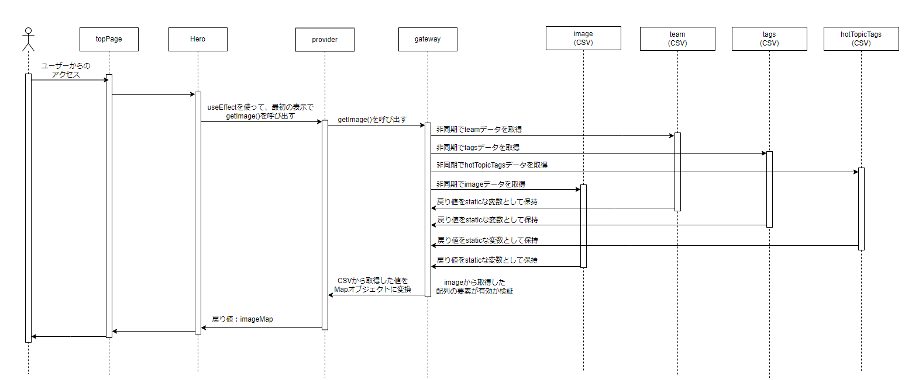
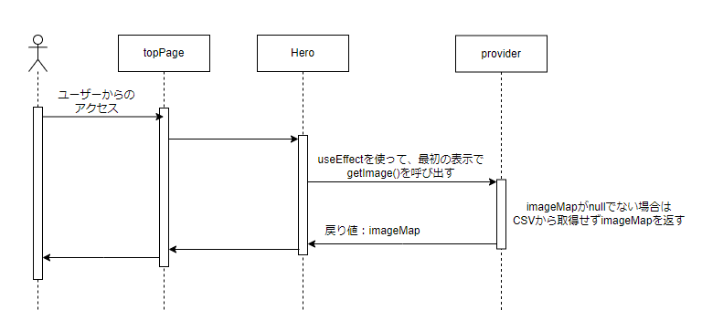

# iw-showroom-webapp　詳細設計書

- [iw-showroom-webapp　詳細設計書](#iw-showroom-webapp詳細設計書)
  - [用語](#用語)
  - [実現すべき機能](#実現すべき機能)
  - [実現方針](#実現方針)
    - [ID1](#id1)
      - [ID1-1](#id1-1)
        - [アーキテクチャ図](#アーキテクチャ図)
        - [クラス図](#クラス図)
          - [topPage](#toppage)
          - [detail](#detail)
          - [search](#search)
        - [ファイル構成](#ファイル構成)
          - [削除するファイル](#削除するファイル)
          - [追加するファイル](#追加するファイル)
      - [ID1-2](#id1-2)
        - [シーケンス図](#シーケンス図)
    - [ID1-3](#id1-3)
      - [CSVから取得したデータの変換](#csvから取得したデータの変換)
    - [ID2](#id2)

| 版  | 日付         | 担当     | 修正箇所 | 修正内容 |
|----|------------|--------|------|------|
| 1.0 | 2023/4/26 | FFS 伊藤 | -    | 新規作成 |

## 用語

  topPage：
* 以下ページを指す。
  
  detail：
* 以下ページを指す。
  
*   search：
* 以下ページを指す。
  

* データ：iw-showroom-webappの画面表示コンポーネントに使用される、表示画像やそれに付随する情報。現iw-showroom-webappのdataフォルダ以下に格納されている値を示す。

* ページコンポーネント：topPage、detail、searchのベースとなっているコンポーネント。
* 部品コンポーネント: ページコンポーネントで使用されているコンポーネント。

## 実現すべき機能

* 現iw-showroom-webappは、tsファイルにコンポーネントが使用する値が直接記載されているため、簡単に表示データを変えることができない。そのため、以下を実施して表示データを簡単に変更できるようにする。
* また、表示データの取得方法が変わったことで現iw-showroom-webappにあった機能を、変更後どのように実現するか決定する。

| ID | やりたいこと | 実現する機能 |
|---|---------------|--------------|
| 1 | 表示データを簡単に変更できるようにしたい。 | CSVから表示データを取得する。|
| 2 | 現iw-showroom-webappに元々備わっている機能(取得した表示データが、有効なデータであるか整合性をとる)も有効にしたい | CSVに記載されているデータ同士の整合性をとる。 |

## 実現方針

### ID1

* ID1を実現するために、以下3つを行う。

| ID | 設計方針 |
|----|--------------|
| 1-1 | tsファイルで定義しているデータをCSVに移行する。|
| 1-2 | データを取得するタイミングを変更、部品コンポーネントが使用する形にデータを加工する。|
| 1-3 | tsファイルと同等の内容をCSVファイルから取得する。|

#### ID1-1

* 現システムで、部品コンポーネントは、tsファイルに直接記載されたデータを参照している。
* tsファイルに直接記載されたデータは11箇所あるため、これらをCSVファイルに移行する。また、CSVファイル移行後も、データを参照している部品コンポーネントが変わらず使用できるよう、CSVから受取得したデータを部品コンポーネントが使用する形に加工する処理を追加する。

* 各コンポーネントの詳細は[現iw-showroom-webapp構成調査書](https://fujifilm0-my.sharepoint.com/:x:/r/personal/10023916_003_fujifilm_com/_layouts/15/Doc.aspx?sourcedoc=%7B32DE0FE6-B080-4226-A6B3-0A8182B2CF03%7D&file=%E6%97%A2%E5%AD%98%E3%81%AE%E6%A7%8B%E6%88%90%E8%AA%BF%E6%9F%BB.xlsx&action=default&mobileredirect=true)に記載。

##### アーキテクチャ図

* 基本の方針としては、tsファイルに記載されているデータをCSVファイルに移行する。
* 部品コンポーネントがデータを参照する場合は、dataでCSVファイルからデータの取得を行い、取得した値を部品コンポーネントが使用できる形に加工し渡す。
* components以上は、変更前と同じ値を受け取れるようにすることで、変更の影響を受けないようにする。

  

| 項目 | 変更前 | 変更後 | 
|----------|--------|--------|
| Pages | ページコンポーネントを表す。 | 変更なし |
| components | 部品コンポーネントを表す。 | 変更なし |
| data | データを記載しているtsファイル。その値を加工しているtsファイルを表す。 | 削除。CSVファイルからのデータ取得、部品コンポーネントが使用する加工の2つの役割が必要になるため、それぞれ2つに分ける。 |
| provider | なし | 部品コンポーネントが使用する形に加工する。|
| gateway | なし | CSVファイルからデータを取得する。|
| CSVファイル | なし | dataのtsファイルに記載されていた値を格納。 |

##### クラス図

* ページコンポーネントごとに、既存と変更後のクラス図を記載する。
* 新規で作成する箇所を黄色、変更する箇所を青色で表す。
* CSVからデータ取得後の処理詳細はID1-2で記載。

###### topPage

  
  

| クラス名 | 変更前 | 変更後 | 
|----------|--------|--------|
| topPage | ページコンポーネント、topPageを表す。 | 変更なし |
| Hero | topPageの部品コンポーネント。imagesから表示データをexportして使用。 | proviserのデータ取得関数を呼び出して引数を使用。 |
| NewImages | topPageの部品コンポーネント。imagesから表示データをexportして使用。 | proviserのデータ取得関数を呼び出して引数を使用。 |
| Ranking | topPageの部品コンポーネントを表す。imagesから表示データをexportして使用。RANKING_IMAGES、SEARCH_WORDS_RANKINGは部品コンポーネントで定義し使用。 | proviserのデータ取得関数を呼び出して引数を使用。 |
| RecommendImages | topPageの部品コンポーネント。imagesから表示データをexportして使用。RECOMMEND_IMAGESは部品コンポーネントで定義し使用。 | proviserのデータ取得関数を呼び出して引数を使用。 |
| TopFreeWordFilter | topPageの部品コンポーネント。SUGGEST_WORDSは部品コンポーネントで定義し使用。 | proviserのデータ取得関数を呼び出して引数を使用。 |
| TopHotTopics | topPageの部品コンポーネント。hotTopicから表示データをexportして使用。 | proviserのデータ取得関数を呼び出して引数を使用。 |
| TopTeams | topPageの部品コンポーネント。teamから表示データをexportして使用。 | proviserのデータ取得関数を呼び出して引数を使用。 |
| proviser | なし | 取得データを部品コンポーネントが使用する形に加工する。|
| gateway | なし | CSVからデータ取得する。|
| image.csv | なし | tsファイルに直接記載されていた画像データをCSVファイルに移行する。 |
| rankingImage.csv | なし | tsファイルに直接記載されていた人気写真ランキング配列をCSVファイルに移行する。 |
| searchWordsRanking.csv | なし | tsファイルに直接記載されていた検索ワードランキング配列をCSVファイルに移行する。 |
| recommendImage.csv | なし | tsファイルに直接記載されていたおすすめ画像名配列をCSVファイルに移行する。 |
| suggestWord.csv | なし | tsファイルに直接記載されていた検索のサジェストワード配列をCSVファイルに移行する。 |
| hotTopicTags.csv | なし | tsファイルに直接記載されていたホットトピックタグ配列をCSVファイルに移行する。 |
| team.csv | なし | tsファイルに直接記載されていたチーム配列をCSVファイルに移行する。 |

###### detail
  
  

| クラス名 | 変更前 | 変更後 | 
|----------|--------|--------|
| detail | ページコンポーネント、detailを表す。 | 変更なし |
| ImageInfoArea | detailの部品コンポーネント。 | 変更なし |
| PriceList | detailの部品コンポーネント。 | 変更なし |
| ButtonArea | detailの部品コンポーネント。 | 変更なし |
| RelativeTags | detailの部品コンポーネント。 | 変更なし |
| RelativeImages | detailの部品コンポーネント。 | 変更なし |
| hooks | ユーザーにクリックされた画像データを取得する。imagesから表示データをexportして使用。 | proviserのデータ取得関数を呼び出して引数を使用。 |
| provider | なし | 取得データを部品コンポーネントが使用する形に加工する。 |
| gateway | なし | CSVからデータ取得する。|
| image.csv | なし | topPageと同様。 |

###### search

   
   

| クラス名 | 変更前 | 変更後 | 
|----------|--------|--------|
| search | ページコンポーネント、searchを表す。 | 変更なし |
| Filters | searchの部品コンポーネント。tagから表示データをexportして使用。 | proviserのデータ取得関数を呼び出して引数を使用。 |
| SelectedFilterTags | searchの部品コンポーネント。 | 変更なし |
| FilteredImages | searchの部品コンポーネント。 | 変更なし |
| Jotai | 現ページの状態(検索に使用している文字列、こだわり条件フィルタなど)を管理している。 | 変更なし |
| provider | なし | 取得データを部品コンポーネントが使用する形に加工する。 |
| gateway | なし | CSVからデータ取得する。|
| gameSceneTags.csv | なし | tsファイルに直接記載されていた試合タイプタグ配列をCSVファイルに移行する。 |
| managerTags.csv | なし | tsファイルに直接記載されていた選手以外タグ配列をCSVファイルに移行する。 |
| gameTypeTags.csv | なし | tsファイルに直接記載されていた試合シーンタグ配列をCSVファイルに移行する。 |
| situationTags.csv | なし | tsファイルに直接記載されていた状況タグ配列をCSVファイルに移行する。 |

##### ファイル構成

* 現在のファイル構成から削除するファイルと、追加するファイルを以下表にまとめる。

###### 削除するファイル

| フォルダ/ファイル | 変更前 | 変更後 |
|-------------------|--------|--------|
| data | 画像などの表示に必要なデータを格納し、そのデータを加工して部品コンポーネントに渡す。 | データはCSVファイル、データの取得はgateway、加工はproviderで行う。 |
| features | ページコンポーネントが使用する、部品コンポーネントを格納。 | 一部tsファイルに直接記載されているデータ配列はCSVファイルに移行。 |

###### 追加するファイル

* 現在のファイル構成に、以下ファイルを追加する。

| フォルダ | ファイル名 | 概要 |
|-------------------|------------|------|
| provider | data-provider.ts | 取得データを部品コンポーネントが使用する形に加工する。 |
| gateway | data-gateway.ts | CSVからデータ取得する。 |
| csv | image.csv | 画像データCSV |
| | rankingImage.csv | 人気写真ランキングCSV |
| | searchWordsRanking.csv | 検索ワードランキングCSV |
| | recommendImage.csv | おすすめ画像CSV |
| | suggestWord.csv | 検索のサジェストワードCSV |
| | hotTopicTags.csv | ホットトピックタグCSV |
| | team.csv | チームCSV |
| | gameSceneTags.csv | 試合タイプタグCSV |
| | managerTags.csv | 選手以外タグCSV |
| | gameTypeTags.csv | 試合シーンタグCSV |
| | situationTags.csv | 状況タグCSV |

#### ID1-2

* 現システムでは、部品コンポーネントが使用するデータは、必要な時直接データを取得していた。
* データをCSVに移行すると、CSVの読み込み時間がかかるため、データを読み込むタイミングを修正する必要がある。
* また、データを参照するたびにCSVを読み込むのではなく、一度しかデータは読み込まず、値を使いまわすようにしたい。

##### シーケンス図

* ID1-1より、CSVファイルは11ファイル作成するため、それぞれの取得タイミングを決定する。
* CSVファイルからデータを取得する際は、非同期処理で行う。その際、Promise.allを使用する。
* 取得した値は、providerでstaticな変数として保持する。2回目以降はその値を参照する。
* CSVファイルの記載方法、CSVから取得したデータの加工はID1-3にて詳細を記載する。
* imageからデータ取得する際は、imageの要素「teams」「tag」がteams.csv、tag.csvに存在するかのチェックを行う。(詳細はID2にて記載)
* tag.csvは4つのcsvデータを合わせた値を参照する。
* 複数箇所あるが同様の方法のため、例としてHeroコンポーネントの場合を記載する。

  

* データ取得が2回目以降
  

* images.csvのデータを取得するときの関数

| 関数名 | 役割 | 引数 | 引数型 | 引数役割 | 戻り値 | 戻り値型 | 戻り値役割 |
|--------|------|------|--------|----------|--------|----------|------------|
| getImage | 部品コンポーネントが表示するため画像データを返す。 | なし | - | - | imageMap | Mapオブジェクト | 画像データ |

* team.csvのデータを取得するときの関数

| 関数名 | 役割 | 引数 | 引数型 | 引数役割 | 戻り値 | 戻り値型 | 戻り値役割 |
|--------|------|------|--------|----------|--------|----------|------------|
| getTeam | 部品コンポーネントが表示するため球団データを返す。 | なし | - | - | teamMap | Mapオブジェクト | 球団データ |

* rankingImage.csvのデータを取得するときの関数

| 関数名 | 役割 | 引数 | 引数型 | 引数役割 | 戻り値 | 戻り値型 | 戻り値役割 |
|--------|------|------|--------|----------|--------|----------|------------|
| getRankingImage | 部品コンポーネントが表示するため人気写真ランキングデータを返す。 | なし | - | - | recommendImagesArray | stringの配列 | 人気写真ランキングデータ |

* searchWordsRanking.csvのデータを取得するときの関数

| 関数名 | 役割 | 引数 | 引数型 | 引数役割 | 戻り値 | 戻り値型 | 戻り値役割 |
|--------|------|------|--------|----------|--------|----------|------------|
| getSearchWordsRanking. | 部品コンポーネントが表示するため検索ワードランキングデータを返す。 | なし | - | - | searchWordsRankingArray | stringの配列 | 検索ワードランキングデータ |

* recommendImage.csvのデータを取得するときの関数

| 関数名 | 役割 | 引数 | 引数型 | 引数役割 | 戻り値 | 戻り値型 | 戻り値役割 |
|--------|------|------|--------|----------|--------|----------|------------|
| getRecommendImage. | 部品コンポーネントが表示するためおすすめワードランキングデータを返す。 | なし | - | - | recommendImageArray | stringの配列 | おすすめワードランキングデータ |

* suggestWord.csvのデータを取得するときの関数

| 関数名 | 役割 | 引数 | 引数型 | 引数役割 | 戻り値 | 戻り値型 | 戻り値役割 |
|--------|------|------|--------|----------|--------|----------|------------|
| getSuggestWord. | 部品コンポーネントが表示するためサジェストワードデータを返す。 | なし | - | - | suggestWordArray | stringの配列 | サジェストワードデータ |

* hotTopicTags.csvのデータを取得するときの関数

| 関数名 | 役割 | 引数 | 引数型 | 引数役割 | 戻り値 | 戻り値型 | 戻り値役割 |
|--------|------|------|--------|----------|--------|----------|------------|
| getHotTopicTags | 部品コンポーネントが表示するためホットトピックタグを返す。 | なし | - | - | hotTopicTagsArray | stringの配列 | ホットトピックタグデータ |

* genresを取得するときの関数

| 関数名 | 役割 | 引数 | 引数型 | 引数役割 | 戻り値 | 戻り値型 | 戻り値役割 |
|--------|------|------|--------|----------|--------|----------|------------|
| getGenres | 部品コンポーネントが表示するためジャンル(全タグデータ)を返す。 | なし | - | - | genresArray | stringの配列 | ジャンルデータ |

### ID1-3

#### CSVから取得したデータの変換

* CSV→Mapオブジェクトの変換方法

### ID2

* 本設計に必要な部分のみ記載する。
 

* 削除するファイル

| フォルダ/ファイル | | | 理由 |
|-------------------|-|-|------|
| data | player | data.ts | 現iw-showroom-webappでは、imageから取得した画像データのplayer要素の型定義のために使用していた。しかし、playerはここでしか使用されていないため、型定義をしなくても問題ないと判断。 |
| data | player | index.ts | 同上 |

* 追加するファイル

| フォルダ/ファイル | | 概要 |
|-------------------|-|------|
| | | | |
| | | |
| | | | |
| | | |