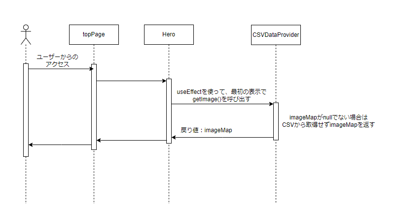

# iw-showroom-webapp　詳細設計書

- [iw-showroom-webapp　詳細設計書](#iw-showroom-webapp詳細設計書)
  - [用語](#用語)
  - [実現すべき機能](#実現すべき機能)
  - [実現方針](#実現方針)
    - [ID1](#id1)
      - [ID1-1](#id1-1)
        - [アーキテクチャ図](#アーキテクチャ図)
        - [クラス図](#クラス図)
          - [topPage](#toppage)
          - [detail](#detail)
          - [search](#search)
        - [ファイル構成](#ファイル構成)
          - [削除するファイル](#削除するファイル)
          - [追加するファイル](#追加するファイル)
      - [ID1-2](#id1-2)
        - [シーケンス図](#シーケンス図)
          - [providerの関数](#providerの関数)
          - [gatewayの関数](#gatewayの関数)
    - [ID1-3](#id1-3)
      - [CSVの記載方法](#csvの記載方法)
      - [CSVのデータ取得方法](#csvのデータ取得方法)
      - [CSVデータの加工](#csvデータの加工)
        - [image.csv](#imagecsv)
        - [rankingImage.csv、searchWordsRanking.csv、recommendImage.csv、suggestWord.csv、hotTopicTags.csv](#rankingimagecsvsearchwordsrankingcsvrecommendimagecsvsuggestwordcsvhottopictagscsv)
        - [gameSceneTags.csv、managerTags.csv、gameTypeTags.csv、situationTags.csv](#gamescenetagscsvmanagertagscsvgametypetagscsvsituationtagscsv)
    - [ID2](#id2)
      - [型](#型)

| 版  | 日付         | 担当     | 修正箇所 | 修正内容 |
|----|------------|--------|------|------|
| 1.0 | 2023/4/26 | FFS 伊藤 | -    | 新規作成 |

## 用語

  topPage：
* 以下ページを指す。
  
  detail：
* 以下ページを指す。
  
*   search：
* 以下ページを指す。
  

* データ：iw-showroom-webappの画面表示コンポーネントに使用される、表示画像やそれに付随する情報。現iw-showroom-webappのdataフォルダ以下に格納されている値を示す。

* ページコンポーネント：topPage、detail、searchのベースとなっているコンポーネント。
* 部品コンポーネント: ページコンポーネントで使用されているコンポーネント。

## 実現すべき機能

* 現iw-showroom-webappは、tsファイルにコンポーネントが使用する値が直接記載されているため、簡単に表示データを変えることができない。そのため、以下を実施して表示データを簡単に変更できるようにする。
* また、表示データの取得方法が変わったことで現iw-showroom-webappにあった機能を、変更後どのように実現するか決定する。

| ID | やりたいこと | 実現する機能 |
|---|---------------|--------------|
| 1 | 表示データを簡単に変更できるようにしたい。 | CSVから表示データを取得する。|
| 2 | 現iw-showroom-webappに元々備わっている機能(取得した表示データが、有効なデータであるか整合性をとる)も有効にしたい | CSVに記載されているデータ同士の整合性をとる。 |

## 実現方針

### ID1

* ID1を実現するために、以下3つを行う。

| ID | 設計方針 |
|----|--------------|
| 1-1 | tsファイルで定義しているデータをCSVに移行する。|
| 1-2 | データを取得するタイミングを変更、部品コンポーネントが使用する形にデータを加工する。|
| 1-3 | tsファイルと同等の内容をCSVファイルから取得する。|

#### ID1-1

* 現システムで、部品コンポーネントは、tsファイルに直接記載されたデータを参照している。
* tsファイルに直接記載されたデータは11箇所あるため、これらをCSVファイルに移行する。また、CSVファイル移行後も、データを参照している部品コンポーネントが変わらず使用できるよう、CSVから取得したデータを部品コンポーネントが使用する形に加工する処理を追加する。

* 各コンポーネントの詳細は[現iw-showroom-webapp構成調査書](https://fujifilm0-my.sharepoint.com/:x:/r/personal/10023916_003_fujifilm_com/_layouts/15/Doc.aspx?sourcedoc=%7B32DE0FE6-B080-4226-A6B3-0A8182B2CF03%7D&file=%E6%97%A2%E5%AD%98%E3%81%AE%E6%A7%8B%E6%88%90%E8%AA%BF%E6%9F%BB.xlsx&action=default&mobileredirect=true)に記載。

##### アーキテクチャ図

* 基本の方針としては、tsファイルに記載されているデータをCSVファイルに移行する。
* 部品コンポーネントがデータを参照する場合は、gatewayでCSVファイルからデータの取得を行い、providerで取得した値を部品コンポーネントが使用できる形に加工し渡す。
* components以上は、変更前と同じ値を受け取れるようにすることで、変更の影響を受けないようにする。

  

| 項目 | 変更前 | 変更後 | 
|----------|--------|--------|
| Pages | ページコンポーネントを表す。 | 変更なし |
| components | 部品コンポーネントを表す。 | 変更なし |
| data | データを記載しているtsファイル。その値を加工しているtsファイルを表す。 | 削除。CSVファイルからのデータ取得、部品コンポーネントが使用する加工の2つの役割が必要になるため、それぞれ2つに分ける。 |
| provider | なし | 部品コンポーネントが使用する形に加工する。|
| gateway | なし | CSVファイルからデータを取得する。|
| CSVファイル | なし | dataのtsファイルに記載されていた値を格納。 |

##### クラス図

* ページコンポーネントごとに、既存と変更後のクラス図を記載する。
* 新規で作成する箇所を黄色、変更する箇所を青色で表す。
* CSVからデータ取得後の処理詳細はID1-2で記載。

###### topPage

  
   


| クラス名 | 変更前 | 変更後 | 
|----------|--------|--------|
| topPage | ページコンポーネント、topPageを表す。 | 変更なし |
| Hero | topPageの部品コンポーネント。imagesから表示データをexportして使用。 | proviserのデータ取得関数を呼び出して引数を使用。 |
| NewImages | topPageの部品コンポーネント。imagesから表示データをexportして使用。 | proviserのデータ取得関数を呼び出して引数を使用。 |
| Ranking | topPageの部品コンポーネントを表す。imagesから表示データをexportして使用。RANKING_IMAGES、SEARCH_WORDS_RANKINGは部品コンポーネントで定義し使用。 | proviserのデータ取得関数を呼び出して引数を使用。 |
| RecommendImages | topPageの部品コンポーネント。imagesから表示データをexportして使用。RECOMMEND_IMAGESは部品コンポーネントで定義し使用。 | proviserのデータ取得関数を呼び出して引数を使用。 |
| TopFreeWordFilter | topPageの部品コンポーネント。SUGGEST_WORDSは部品コンポーネントで定義し使用。 | proviserのデータ取得関数を呼び出して引数を使用。 |
| TopHotTopics | topPageの部品コンポーネント。hotTopicから表示データをexportして使用。 | proviserのデータ取得関数を呼び出して引数を使用。 |
| TopTeams | topPageの部品コンポーネント。teamから表示データをexportして使用。 | proviserのデータ取得関数を呼び出して引数を使用。 |
| proviser | なし | 取得データを部品コンポーネントが使用する形に加工する。|
| gateway | なし | CSVからデータ取得する。|
| image.csv | なし | tsファイルに直接記載されていた画像データをCSVファイルに移行する。 |て使用。RANKING_IMAGES、SEARCH_WORDS_RANKINGは部品コンポーネントで定義し使用。	proviserのデータ取得関数を呼び出して引数を使用
| rankingImage.csv | なし | tsファイルに直接記載されていた人気写真ランキング配列をCSVファイルに移行する。 |
| searchWordsRanking.csv | なし | tsファイルに直接記載されていた検索ワードランキング配列をCSVファイルに移行する。 |
| recommendImage.csv | なし | tsファイルに直接記載されていたおすすめ画像名配列をCSVファイルに移行する。 |
| suggestWord.csv | なし | tsファイルに直接記載されていた検索のサジェストワード配列をCSVファイルに移行する。 |
| hotTopicTags.csv | なし | tsファイルに直接記載されていたホットトピックタグ配列をCSVファイルに移行する。 |
| team.csv | なし | tsファイルに直接記載されていたチーム配列をCSVファイルに移行する。 |

###### detail
    
  

| クラス名 | 変更前 | 変更後 | 
|----------|--------|--------|
| detail | ページコンポーネント、detailを表す。 | 変更なし |
| ImageInfoArea | detailの部品コンポーネント。 | 変更なし |
| PriceList | detailの部品コンポーネント。 | 変更なし |
| ButtonArea | detailの部品コンポーネント。 | 変更なし |
| RelativeTags | detailの部品コンポーネント。 | 変更なし |
| RelativeImages | detailの部品コンポーネント。 | 変更なし |
| hooks | ユーザーにクリックされた画像データを取得する。imagesから表示データをexportして使用。 | proviserのデータ取得関数を呼び出して引数を使用。 |
| provider | なし | 取得データを部品コンポーネントが使用する形に加工する。 |
| gateway | なし | CSVからデータ取得する。|
| image.csv | なし | topPageと同様。 |

###### search

   
   


| クラス名 | 変更前 | 変更後 | 
|----------|--------|--------|
| search | ページコンポーネント、searchを表す。 | 変更なし |
| Filters | searchの部品コンポーネント。tagから表示データをexportして使用。 | proviserのデータ取得関数を呼び出して引数を使用。 |
| SelectedFilterTags | searchの部品コンポーネント。 | 変更なし |
| FilteredImages | searchの部品コンポーネント。 | 変更なし |
| Jotai | 現ページの状態(検索に使用している文字列、こだわり条件フィルタなど)を管理している。 | 変更なし |
| provider | なし | 取得データを部品コンポーネントが使用する形に加工する。 |
| gateway | なし | CSVからデータ取得する。|
| gameSceneTags.csv | なし | tsファイルに直接記載されていた試合タイプタグ配列をCSVファイルに移行する。 |
| managerTags.csv | なし | tsファイルに直接記載されていた選手以外タグ配列をCSVファイルに移行する。 |
| gameTypeTags.csv | なし | tsファイルに直接記載されていた試合シーンタグ配列をCSVファイルに移行する。 |
| situationTags.csv | なし | tsファイルに直接記載されていた状況タグ配列をCSVファイルに移行する。 |

##### ファイル構成

* 現在のファイル構成から削除するファイルと、追加するファイルを以下表にまとめる。

###### 削除するファイル

| フォルダ | フォルダ | フォルダ | 変更前 | 変更後 |
|----------|----------|----------|--------|--------|
| data |  |  | 画像などの表示に必要なデータを格納し、そのデータを加工して部品コンポーネントに渡す。 | データはCSVファイル、データの取得はgateway、加工はproviderで行う。 |
| features | Ranking | RankingImages.tsx | ページコンポーネントが使用する、部品コンポーネントを格納。 | 一部tsファイルに直接記載されているデータ配列はCSVファイルに移行。 |
|  |  | RankingSearchWords.tsx | ページコンポーネントが使用する、部品コンポーネントを格納。 | 一部tsファイルに直接記載されているデータ配列はCSVファイルに移行。 |
|  | RecommendImages | index.tsx | ページコンポーネントが使用する、部品コンポーネントを格納。 | 一部tsファイルに直接記載されているデータ配列はCSVファイルに移行。 |
|  | TopFreeWordFilter | index.tsx | ページコンポーネントが使用する、部品コンポーネントを格納。 | 一部tsファイルに直接記載されているデータ配列はCSVファイルに移行。 |


###### 追加するファイル

* 現在のファイル構成に、以下ファイルを追加する。

| フォルダ | ファイル名 | 概要 |
|-------------------|------------|------|
| provider | data-provider.ts | 取得データを部品コンポーネントが使用する形に加工する。 |
| gateway | data-gateway.ts | CSVからデータ取得する。 |
| csv | image.csv | 画像データCSV |
| | rankingImage.csv | 人気写真ランキングCSV |
| | searchWordsRanking.csv | 検索ワードランキングCSV |
| | recommendImage.csv | おすすめ画像CSV |
| | suggestWord.csv | 検索のサジェストワードCSV |
| | hotTopicTags.csv | ホットトピックタグCSV |
| | team.csv | チームCSV |
| | gameSceneTags.csv | 試合タイプタグCSV |
| | managerTags.csv | 選手以外タグCSV |
| | gameTypeTags.csv | 試合シーンタグCSV |
| | situationTags.csv | 状況タグCSV |

#### ID1-2

* 現システムでは、部品コンポーネントが使用するデータは、必要な時直接データを取得していた。
* データをCSVに移行すると、CSVの読み込み時間がかかるため、データを読み込むタイミングを修正する必要がある。
* また、データを参照するたびにCSVを読み込むのではなく、一度しかデータは読み込まず、値を使いまわすようにしたい。

##### シーケンス図

* ID1-1より、CSVファイルは11ファイル作成するため、それぞれの取得タイミングを決定する。
* CSVファイルからデータを取得する際は、非同期処理で行う。その際、Promise.allを使用する。
* 取得した値は、providerでstaticな変数として保持する。2回目以降はその値を参照する。
* CSVファイルの記載方法、CSVから取得したデータの加工はID1-3にて詳細を記載する。
* imageからデータ取得する際は、imageの要素「teams」「tag」がteams.csv、tag.csvに存在するかのチェックを行う。(詳細はID2にて記載)
* tag.csvは4つのcsvデータを合わせた値を参照する。
* 複数箇所あるが同様の方法のため、例としてHeroコンポーネントの場合を記載する。
 
  

* データ取得が2回目以降 
  

###### providerの関数

* 以下はimages.csvのデータを加工する関数。
* Hero、NewImages、Ranking、RecommendImages、ImageInfoArea、PriceList、ButtonArea、RelativeTags、RelativeImagesコンポーネントで使用。

| 関数名 | 役割 | 引数 | 引数型 | 引数役割 | 戻り値 | 戻り値型 | 戻り値役割 |
|--------|------|------|--------|----------|--------|----------|------------|
| getImage | 部品コンポーネントが表示するため画像データを返す。 | なし | - | - | imageMap | 画像名をキー、その他画像データ(選手名、球団名、撮影年、価格、配信開始日、タイトル、タグ、兄弟写真、ピックアップ画像かのフラグ)を値とするMapオブジェクト | 画像データ |

* 以下はteam.csvのデータを加工する関数。
* TopHotTopicsコンポーネントで使用。

| 関数名 | 役割 | 引数 | 引数型 | 引数役割 | 戻り値 | 戻り値型 | 戻り値役割 |
|--------|------|------|--------|----------|--------|----------|------------|
| getTeam | 部品コンポーネントが表示するため球団データを返す。 | なし | - | - | teamMap | 球団名をキー、その他球団データ(球団id、リーグ、旧球団名)を値とするMapオブジェクト | 球団データ |

* 以下はrankingImage.csvのデータを加工する関数。
* Rankingコンポーネントで使用。

| 関数名 | 役割 | 引数 | 引数型 | 引数役割 | 戻り値 | 戻り値型 | 戻り値役割 |
|--------|------|------|--------|----------|--------|----------|------------|
| getRankingImage | 部品コンポーネントが表示するため人気写真ランキングデータを返す。 | なし | - | - | recommendImagesArray | stringの配列 | 人気写真ランキングデータ |

* 以下はsearchWordsRanking.csvのデータを加工する関数。
* SearchWordsRankingコンポーネントで使用。

| 関数名 | 役割 | 引数 | 引数型 | 引数役割 | 戻り値 | 戻り値型 | 戻り値役割 |
|--------|------|------|--------|----------|--------|----------|------------|
| getSearchWordsRanking | 部品コンポーネントが表示するため検索ワードランキングデータを返す。 | なし | - | - | searchWordsRankingArray | stringの配列 | 検索ワードランキングデータ |

* recommendImage.csvのデータを加工する関数。
* RecommendImageコンポーネントで使用。

| 関数名 | 役割 | 引数 | 引数型 | 引数役割 | 戻り値 | 戻り値型 | 戻り値役割 |
|--------|------|------|--------|----------|--------|----------|------------|
| getRecommendImage | 部品コンポーネントが表示するためおすすめワードランキングデータを返す。 | なし | - | - | recommendImageArray | stringの配列 | おすすめワードランキングデータ |

* suggestWord.csvのデータを加工する関数。
* TopFreeWordFilterコンポーネントで使用。

| 関数名 | 役割 | 引数 | 引数型 | 引数役割 | 戻り値 | 戻り値型 | 戻り値役割 |
|--------|------|------|--------|----------|--------|----------|------------|
| getSuggestWord | 部品コンポーネントが表示するためサジェストワードデータを返す。 | なし | - | - | suggestWordArray | stringの配列 | サジェストワードデータ |

* hotTopicTags.csvのデータを加工する関数。
* TopHotTopicsコンポーネントで使用。

| 関数名 | 役割 | 引数 | 引数型 | 引数役割 | 戻り値 | 戻り値型 | 戻り値役割 |
|--------|------|------|--------|----------|--------|----------|------------|
| getHotTopicTags | 部品コンポーネントが表示するためホットトピックタグを返す。 | なし | - | - | hotTopicTagsArray | stringの配列 | ホットトピックタグデータ |

* gameSceneTags.csv、managerTags.csv、gameTypeTags.csv、situationTags.csvのデータを加工する関数。
* Filtersコンポーネントで使用。

| 関数名 | 役割 | 引数 | 引数型 | 引数役割 | 戻り値 | 戻り値型 | 戻り値役割 |
|--------|------|------|--------|----------|--------|----------|------------|
| getGenres | 部品コンポーネントが表示するためジャンル(全タグデータ)を返す。 | なし | - | - | genresArray | stringの配列 | ジャンルデータ |

###### gatewayの関数

* images.csvのデータを取得する関数

| 関数名 | 役割 | 引数 | 引数型 | 引数役割 | 戻り値 | 戻り値型 | 戻り値役割 |
|--------|------|------|--------|----------|--------|----------|------------|
| getImageCSV | 部品コンポーネントが表示するため画像データを返す。 | なし | - | - | imageArray | Promise配列 | 画像データ |

* team.csvのデータを取得する関数

| 関数名 | 役割 | 引数 | 引数型 | 引数役割 | 戻り値 | 戻り値型 | 戻り値役割 |
|--------|------|------|--------|----------|--------|----------|------------|
| getTeamCSV | 部品コンポーネントが表示するため球団データを返す。 | なし | - | - | teamArray | Promise配列 | 球団データ |

* rankingImage.csvのデータを取得する関数

| 関数名 | 役割 | 引数 | 引数型 | 引数役割 | 戻り値 | 戻り値型 | 戻り値役割 |
|--------|------|------|--------|----------|--------|----------|------------|
| getRankingImageCSV | 部品コンポーネントが表示するため人気写真ランキングデータを返す。 | なし | - | - | recommendImagesArray | Promise配列 | 人気写真ランキングデータ |

* searchWordsRanking.csvのデータを取得する関数

| 関数名 | 役割 | 引数 | 引数型 | 引数役割 | 戻り値 | 戻り値型 | 戻り値役割 |
|--------|------|------|--------|----------|--------|----------|------------|
| getSearchWordsRankingCSV | 部品コンポーネントが表示するため検索ワードランキングデータを返す。 | なし | - | - | searchWordsRankingArray | Promise配列 | 検索ワードランキングデータ |

* recommendImage.csvのデータを取得する関数

| 関数名 | 役割 | 引数 | 引数型 | 引数役割 | 戻り値 | 戻り値型 | 戻り値役割 |
|--------|------|------|--------|----------|--------|----------|------------|
| getRecommendImageCSV | 部品コンポーネントが表示するためおすすめワードランキングデータを返す。 | なし | - | - | recommendImageArray | Promise配列 | おすすめワードランキングデータ |

* suggestWord.csvのデータを取得する関数

| 関数名 | 役割 | 引数 | 引数型 | 引数役割 | 戻り値 | 戻り値型 | 戻り値役割 |
|--------|------|------|--------|----------|--------|----------|------------|
| getSuggestWordCSV | 部品コンポーネントが表示するためサジェストワードデータを返す。 | なし | - | - | suggestWordArray | Promise配列 | サジェストワードデータ |

* hotTopicTags.csvのデータを取得する関数

| 関数名 | 役割 | 引数 | 引数型 | 引数役割 | 戻り値 | 戻り値型 | 戻り値役割 |
|--------|------|------|--------|----------|--------|----------|------------|
| getHotTopicTagsCSV | 部品コンポーネントが表示するためホットトピックタグを返す。 | なし | - | - | hotTopicTagsArray | Promise配列 | ホットトピックタグデータ |

* gameSceneTags.csv、managerTags.csv、gameTypeTags.csv、situationTags.csvのデータを取得する関数

| 関数名 | 役割 | 引数 | 引数型 | 引数役割 | 戻り値 | 戻り値型 | 戻り値役割 |
|--------|------|------|--------|----------|--------|----------|------------|
| getGenresCSV | 部品コンポーネントが表示するためジャンル(全タグデータ)を返す。 | なし | - | - | genresArray | Promise配列 | ジャンルデータ |
### ID1-3

#### CSVの記載方法

* 各要素は「,」で区切って記載する。
* 要素が複数あるもの(選手名、球団名、タグ、兄弟写真、旧球団名)は最大値を設定する。最大値以下の場合は空欄にしておく。

| 要素 | 最大値 |
|--------|------|
| 選手名 | 10 |
| 球団名 | 5 |
| タグ | 5 |
| 兄弟写真 | 5 |
| 旧球団名 | 5 |

* priceは全ての画像データで同じため、CSVからデータ取得後に値を設定する。

image.csv
* 左から、画像名, 選手名, 球団名, 撮影年, 価格, 配信開始日,タイトル, タグ, 兄弟写真, TOPのHeroエリアへの掲載有無の順で記載する。
* 一行目は要素名を記載する。
```
221125O-0080e.jpg, 村上宗隆,岡林勇希,岡林勇希,近本光司, , , , , , , , , , , , 2022, prices, 2022-11-25, NPBアワードで表彰を受ける村上ら, NPBアワード,表彰, , , , , , , , , false
221125O-0114e.jpg, 山本由伸, , , , , , , , , , , , , , , 2022, prices, 2022-11-25, 沢村賞を受賞し表彰を受ける山本由伸, NPBアワード,表彰, , , , , , , , , false
220727O-0001e_17.jpg, 佐々木朗希, , , , , , , , , , , , , , , ロッテ, 2022, prices, 2022-7-27, オールスター第二戦に登板する佐々木朗希, オールスター,投球, , , , 220727O-0002e_17.jpg,220727O-0003e_17.jpg,220727O-0005e_17.jpg,220727O-0006e_17.jpg, , false
221022Bs-0066i_55.jpg, 村上宗隆, , , , , , , , , , ヤクルト, , , , , 2022, prices, 2022-10-22, 日本シリーズ第一戦に出場する村上宗隆, 日本シリーズ,打撃, , , , , , , , , true
```
team.csv
* 左から、球団名, id, 旧球団名の順で記載する。
```
ヤクルト, yakult, central, 
阪神, hanshin, central,
オリックス, orix, pacific, 
ロッテ, lotte, pacific, 
```
rankingImage.csv、searchWordsRanking.csv、recommendImage.csv、suggestWord.csv、hotTopicTags.csv
```
221030Bs-0004d.jpg, 220727O-0027g_17_md.jpg, 220727O-0037l_md.jpg, 220727O-0072g_17_md.jpg, 221030S-0062e_13_md.jpg
```
gameSceneTags.csv、managerTags.csv、gameTypeTags.csv、situationTags.csv
* 左から、タグのジャンル名, タグの順で記載する。
```
試合シーン, 投球, 打撃, 守備, 走塁
```

#### CSVのデータ取得方法

* 「fs.createReadStream(path)」を使用する。

#### CSVデータの加工

##### image.csv
* csv→Mapオブジェクトに加工する。
* そのために①-⑥を行う。

① csvのデータは二次元配列で取得する。
```
[
    [221125O-0080e.jpg, 村上宗隆,岡林勇希,岡林勇希,近本光司, , , , , , , , , , , , 2022, prices, 2022-11-25, NPBアワードで表彰を受ける村上ら, NPBアワード,表彰, , , , , , , , , false],
    [221125O-0114e.jpg, 山本由伸, , , , , , , , , , , , , , , 2022, prices, 2022-11-25, 沢村賞を受賞し表彰を受ける山本由伸, NPBアワード,表彰, , , , , , , , , false]
    [220727O-0001e_17.jpg, 佐々木朗希, , , , , , , , , , , , , , , ロッテ, 2022, prices, 2022-7-27, オールスター第二戦に登板する佐々木朗希, オールスター,投球, , , , 220727O-0002e_17.jpg,220727O-0003e_17.jpg,220727O-0005e_17.jpg,220727O-0006e_17.jpg, , false],
    [221022Bs-0066i_55.jpg, 村上宗隆, , , , , , , , , , ヤクルト, , , , , 2022, prices, 2022-10-22, 日本シリーズ第一戦に出場する村上宗隆, 日本シリーズ,打撃, , , , , , , , , true]
]
```
② ⑤でMapのキーとして設定するため、①で取得した二次元配列から画像名の配列を作成する。
```
[221125O-0080e.jpg, 221125O-0114e.jpg, 220727O-0001e_17.jpg, 221022Bs-0066i_55.jpg]
```
③pricesの値を設定する。
```
      prices = [
        {
          label: "S",
          description: ["72dpi 1020×768px"],
          dataType: "jpg",
          price: 1800,
        },
        {
          label: "M",
          description: ["360dpi 1920×1080px"],
          dataType: "jpg",
          price: 2800,
        },
      ],
```
④ ①で取得した二次元配列から、1画像データにつき1つのオブジェクトを作成する。その値を1要素として画像分の配列を作成する。
* ①で取得した二次元配列に対して、forEachメソッドで処理を行う。
* ①の1番目の値をplayerNames、2-11番目の値をteams、12番目をyear、、、としてオブジェクトを作成する。
* 作成したオブジェクトを1要素として画像データ分配列に保存する。

```
[ { playerNames: [村上宗隆, 岡林勇希, 岡林勇希, 近本光司],
  teams: [],
  year: 2022,
  prices: prices,
  uploadDay: 2022-11-25,
  title: NPBアワードで表彰を受ける村上ら,
  tag: [NPBアワード,表彰],
  relative: [],
  pickup: false
  },
　{ playerNames: [山本由伸],
  teams: [],
  year: 2022,
  prices: prices,
  uploadDay: 2022-11-25,
  title: 沢村賞を受賞し表彰を受ける山本由伸,
  tag: [NPBアワード,表彰],
  relative: [],
  pickup: false
  },
  { playerNames: [佐々木朗希],
  teams: [ロッテ],
  year: 2022,
  prices: prices,
  uploadDay: 2022-7-27,
  title: オールスター第二戦に登板する佐々木朗希,
  tag: [オールスター,投球],
  relative: [220727O-0002e_17.jpg, 220727O-0003e_17.jpg, 220727O-0005e_17.jpg, 220727O-0006e_17.jpg],
  pickup: false
  },
  { playerNames: [村上宗隆],
  teams: [ヤクルト],
  year: 2022,
  prices: prices,
  uploadDay: 2022-10-22,
  title: 日本シリーズ第一戦に出場する村上宗隆,
  tag: [日本シリーズ, 打撃],
  relative: [],
  pickup: true
  }
]
```

⑤ ②と⑤で作成した配列から、②をキー、⑤を値としてMapオブジェクトを作成する。

* ①はCSVDataGateway、②-⑥はCSVDataProviderで行う。

##### rankingImage.csv、searchWordsRanking.csv、recommendImage.csv、suggestWord.csv、hotTopicTags.csv
* csv→配列に加工する。
* csvのデータは一次元配列で取得する。
```
[ 221030Bs-0004d.jpg, 220727O-0027g_17_md.jpg, 220727O-0037l_md.jpg, 220727O-0072g_17_md.jpg, 221030S-0062e_13_md.jpg ]
```
* 上記処理はCSVDataProviderで行う。

##### gameSceneTags.csv、managerTags.csv、gameTypeTags.csv、situationTags.csv
* csv→配列(string, string[])に加工する。
* そのために①-③を行う。

① csvのデータは一次元配列で取得する。 
```
[ 試合シーン, 投球, 打撃, 守備, 走塁 ]
```
② 配列の1番目以降の値がタグとなる。タグで配列を作成する。
```
[ 投球,打撃,守備,塁 ]
```
③ 配列の0番目と②で作成した配列を要素として1つの配列を作成する。
```
[
  "試合シーン",
  ["投球", "打撃", "守備", "塁"],
]
```
* ①はCSVDataGateway、②-③はCSVDataProviderで行う。

### ID2

* 現システムには「データが有効か確認する」という機能が備わっている。具体的には、imageの要素である「選手名」、「球団名」、「タグ」は決まったデータ一覧の中から選択されていなければエラーとなる。
* ID1完了後はcsvデータ取得タイミングがユーザーアクセス時になり、これを変更するには修正範囲が計画より大きくなる。
* そのため、本設計ではデータが有効かの確認は行わない。
* 現システムでは、データの要素に想定外の値が入力されるとビルドエラーとなるが、変更後システムではエラーとならない。

#### 型
* 現システムでは、型定義の際に、特定の配列に存在する値しか入力できないように設定している。
```
例：
export type TypePlayerName = typeof playersArray[number];

export const playersArray = [
  "村上宗隆",
  "岡林勇希",
  "近本光司",
  …
  ] as const satisfies readonly string[];
```
* データが有効かの確認は行わないので、型を修正する。
* 以下、現システムに存在する型と、変更後である。

| 変更前型名 | 詳細 | 変更あり/なし | 変更後 | 理由 |
|------------|------|---------------|--------|------|
| TypeImageName | 画像名の型 | あり | 削除 | 画像名はCSVから取得しているため、値に入力制限をかける型は削除。画像名の型はstringを使用する。 |
| TypeTeamName | 球団名の型 | あり | 削除 | 球団名はCSVから取得しているため、値に入力制限をかける型は削除。球団名の型はstringを使用する。 |
| TypePriceFilter | 値段の型 | なし | - | 値段はCSVから取得しないので変更しない。 |
| TypeTeamFilter | 球団フィルターの型 | あり | string |  球団名はCSVから取得しているため、球団フィルターに入力制限をかける型は削除。球団フィルターの型はstringを使用する。 |
| TypeUploadDayFilter | 日付フィルターの型 | なし | - | 日付はCSVから取得しないので変更しない。 |
| TypePlayerName | 選手名の型 | あり | 削除 | 選手名はCSVから取得しているため、値に入力制限をかける型は削除。選手名の型はstringを使用する。 |
| TypeTagName | タグの型 | あり | 削除 |タグはCSVから取得しているため、値に入力制限をかける型は削除。タグの型はstringを使用する。 |
| TypeLeague | リーグの型 | あり | - | リーグはCSVから取得しているため、値に入力制限をかける型は削除。リーグの型はstringを使用する。 |

以上